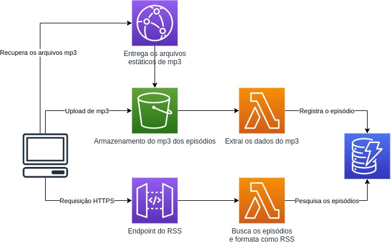

# Host para podcast serverless

Este é um projeto de exemplo para criação de um host para episódios de podcast totalmente serverless.

## Arquitetura

No meu artigo escrito no Linkedin, que você pode [conferir aqui](https://www.linkedin.com/pulse/sem-servidor-podcast-projeto-hosting-pr%C3%B3prio-evandro-pires-da-silva/), escrevi as motivações e o problema.
A ideia foi desenhar um modelo simples de hosting de podcasts que fosse totalmente serverless. 
Os episódios são salvos automaticamente ao fazer um upload do arquivo MP3 no S3, onde a função Lambda extrai as informações do próprio arquivo e registra no DynamoDB, para posteriormente ser consultado pela função que monta o RSS.

### Pendências

Não está contemplado nesse projeto a criação do CloudFront, coisa que ainda deve ser feito.

## Configuração

Tem algumas coisas manuais para fazer para funcionar totalmente (shame on me).
* Criar um CloudFront para entregar os arquivos de MP3 do episódio
* Alterar no arquivo `podcast_rss.py` as URLs base do CloudFront para que seja entregue corretamente no arquivo RSS

**Se quiser contribuir com o projeto, fique a vontade e mande um PR :)**

## Deploy

1. Instalar os plugins: `npm install`
2. Realizar o deploy: `sls deploy`